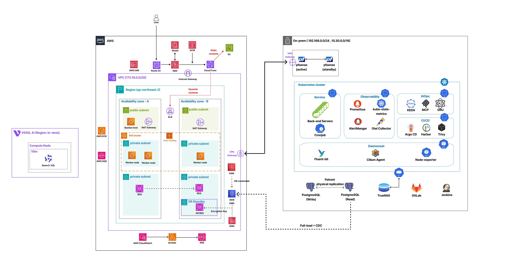
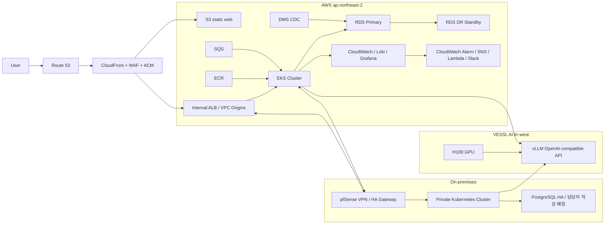
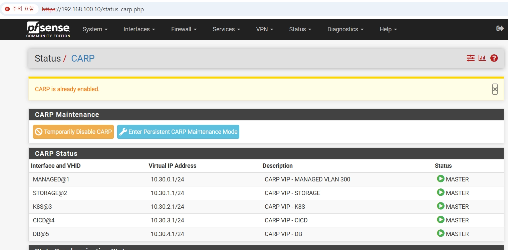
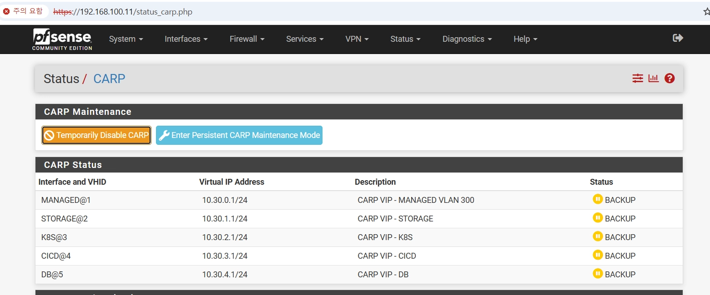
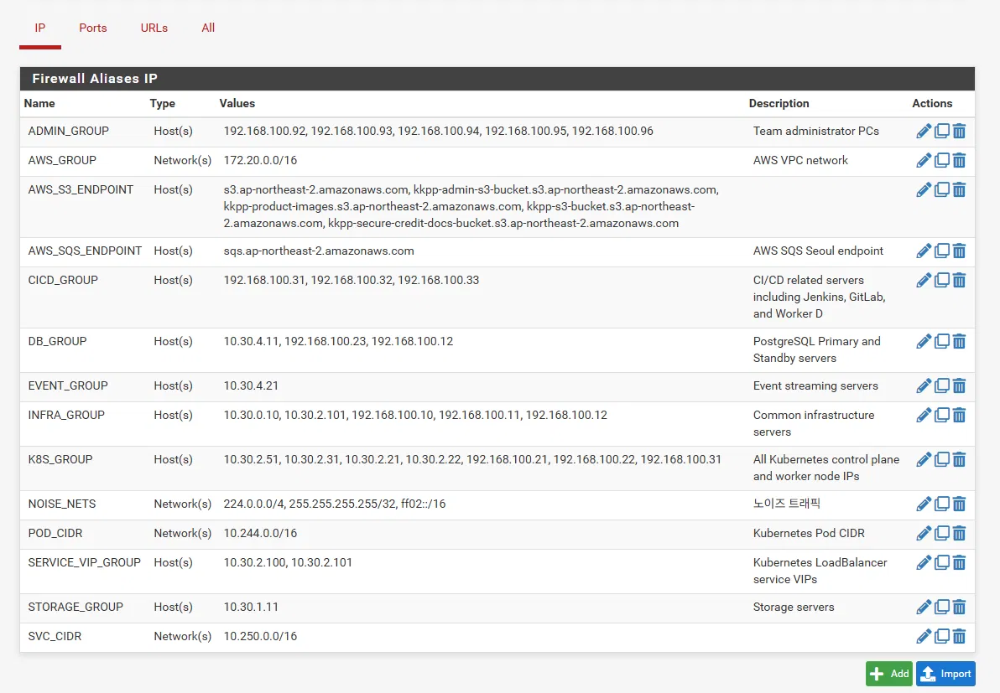
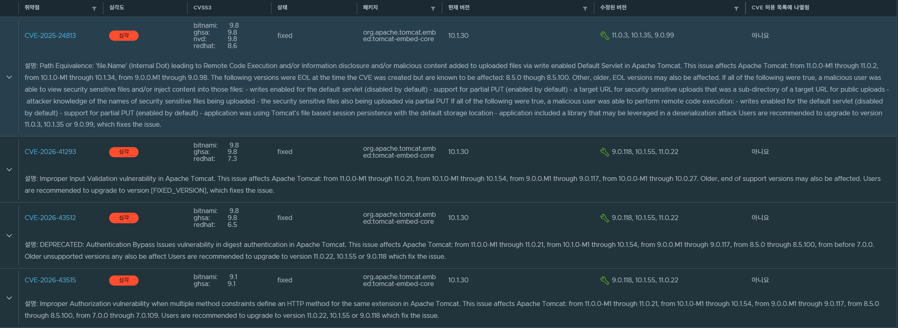
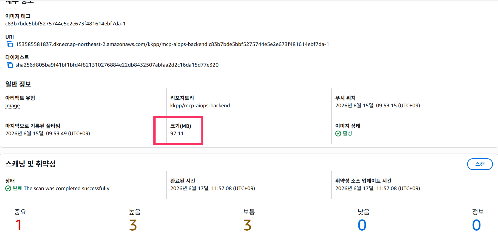
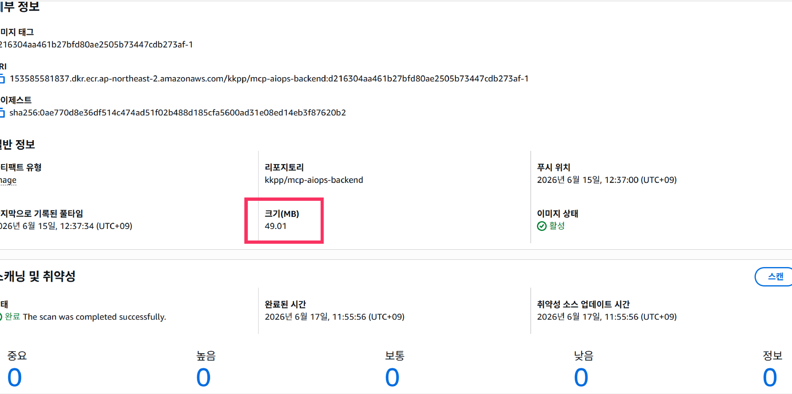

# KKPP Infra - Hybrid Cloud & Internal LLM Platform

> **AWS - On-premises - VESSL AI를 연결한 하이브리드 인프라와 내부 LLM Agent 운영 환경**

KKPP 인프라 레포지토리는 BNPL 서비스와 내부 LLM Agent 플랫폼을 위해 구성한
Terraform 기반 인프라 문서화 저장소입니다.

AWS의 public edge와 EKS 서비스 런타임, 온프레미스 Kubernetes의 private workload,
VESSL AI의 GPU 기반 vLLM 서버를 연결하여 **하이브리드 네트워크, 내부 LLM 추론,
관측성, DR, 비용 추정, 운영 문서화**를 재현할 수 있도록 정리했습니다.

[](https://www.terraform.io/)
[](https://aws.amazon.com/)
[](https://kubernetes.io/)
[](https://www.postgresql.org/)
[](https://www.pfsense.org/)
[](https://www.haproxy.org/)
[](https://www.truenas.com/)
[](https://www.jenkins.io/)
[](https://about.gitlab.com/)
[](https://grafana.com/)
[](https://github.com/vllm-project/vllm)
[](https://vessl.ai/)

---

## 목차

- [1. 프로젝트 배경 및 목표](#1-프로젝트-배경-및-목표)
  - [1.1. 프로젝트 배경](#11-프로젝트-배경)
  - [1.2. 하이브리드 인프라 목표](#12-하이브리드-인프라-목표)
  - [1.3. 운영 관점의 핵심 요구사항](#13-운영-관점의-핵심-요구사항)
  - [1.4. 온프레미스 랩 구성](#14-온프레미스-랩-구성)
- [2. 아키텍처 다이어그램](#2-아키텍처-다이어그램)
- [3. 주요 아키텍처 결정](#3-주요-아키텍처-결정)
  - [3.1. CloudFront 중심의 public edge 통합](#31-cloudfront-중심의-public-edge-통합)
  - [3.2. AWS와 온프레미스 workload 분리](#32-aws와-온프레미스-workload-분리)
  - [3.3. pfSense 기반 하이브리드 VPN 구성](#33-pfsense-기반-하이브리드-vpn-구성)
  - [3.4. PostgreSQL 이중화와 장애 전환](#34-postgresql-이중화와-장애-전환)
  - [3.5. VESSL AI 기반 내부 LLM 추론 분리](#35-vessl-ai-기반-내부-llm-추론-분리)
  - [3.6. Terraform record-only 운영 모델](#36-terraform-record-only-운영-모델)
  - [3.7. Observability와 FinOps 문서화](#37-observability와-finops-문서화)
- [4. 트러블슈팅 및 성능 개선](#4-트러블슈팅-및-성능-개선)
  - [4.1. Harbor/Trivy 이미지 취약점 개선](#41-harbortrivy-이미지-취약점-개선)
  - [4.2. ECR 이미지 용량 및 배포 효율 최적화](#42-ecr-이미지-용량-및-배포-효율-최적화)
- [5. 저장소 구조](#5-저장소-구조)

---

# 1. 프로젝트 배경 및 목표

## 1.1. 프로젝트 배경

이 프로젝트는 BNPL 서비스에서 사용하는 서비스 API, 내부 금융 워크로드,
PostgreSQL 데이터 계층, observability, 그리고 내부 LLM Agent를 하나의
하이브리드 인프라로 연결하기 위해 시작했습니다.

단일 클라우드에 모든 구성요소를 올리는 대신 다음 세 영역을 분리했습니다.

- **AWS**: public edge, EKS 기반 서비스 API, 정적 웹, RDS/DR 기록,
  observability, alerting, cost estimation
- **온프레미스 Kubernetes**: 내부 금융 API, private workload, storage, CI/CD,
  PostgreSQL HA 담당자 작성 영역
- **VESSL AI**: H100 GPU를 임대해 vLLM 기반 내부 LLM 추론 서버 운영

이 저장소는 실제 애플리케이션 코드가 아니라, 위 인프라를 설명하고 검증하기 위한
Terraform, 운영 스크립트, observability dashboard, FinOps 문서를 관리합니다.

---

## 1.2. 하이브리드 인프라 목표

먼저 AWS, 온프레미스, VESSL AI가 각각의 역할을 유지하면서도 사설 네트워크로
연동될 수 있도록 설계했습니다.

```text
User
  -> CloudFront
     -> S3 static web
     -> Internal ALB / VPC origin
        -> AWS EKS service APIs
        -> On-premises private APIs
        -> AIOps / MCP APIs

AWS EKS / On-prem Kubernetes
  -> VESSL AI vLLM endpoint
```

> 결과적으로 public traffic은 CloudFront에서 통제하고, private workload와 LLM
> inference는 내부 네트워크 경계를 통해 접근하는 구조를 목표로 했습니다.

<details>
<summary><strong>1) 네트워크 분리와 연결성</strong></summary>

- public entry point는 CloudFront로 단일화했습니다.
- 정적 admin/user SPA는 S3 website origin에서 제공합니다.
- API 요청은 CloudFront VPC Origin을 통해 internal ALB로 전달합니다.
- AWS, 온프레미스, VESSL AI는 pfSense VPN 기반 연결을 전제로 분리했습니다.
- EKS와 온프레미스 Kubernetes가 private workload와 LLM endpoint를 호출할 수
  있도록 설계했습니다.

</details>

<details>
<summary><strong>2) pfSense 기반 하이브리드 VPN</strong></summary>

- pfSense는 온프레미스 내부 VLAN의 gateway이자 AWS-온프레미스 간 VPN 경계로 구성했습니다.
- WAN은 사설 IP 대역을 사용하는 환경이므로 `Block private networks` 옵션을 비활성화했습니다.
- VLAN 300~304는 CARP VIP를 gateway로 사용하고, Active/Standby pfSense가 VIP를 공유합니다.
- pfsync로 세션/NAT 상태를 동기화하고, XMLRPC Config Sync로 방화벽 룰, NAT, Alias, CARP VIP 설정을 Active에서 Standby로 동기화합니다.
- 방화벽 정책은 Alias 기반 whitelist와 default deny를 기준으로 구성했습니다.

</details>

<details>
<summary><strong>3) 내부 LLM Agent 구성</strong></summary>

- VESSL AI의 H100 GPU에서 vLLM을 실행합니다.
- vLLM은 OpenAI-compatible API로 모델 추론만 담당합니다.
- MCP 서버는 LLM Agent가 사용할 수 있는 backend tool을 제한적으로 노출합니다.
- vLLM과 MCP를 분리해 모델 서버 장애와 도구 호출 권한의 blast radius를 줄였습니다.

</details>

<details>
<summary><strong>4) PostgreSQL 이중화와 DR</strong></summary>

- RDS primary / DR standby 구성을 기록했습니다.
- DMS full-load + CDC replication 흐름을 문서화했습니다.
- KMS key와 Secrets Manager record를 통해 암호화와 secret 관리 의도를 남겼습니다.
- 온프레미스 PostgreSQL 이중화 상세 구성은 담당자 작성 예정입니다.

</details>

---

## 1.3. 운영 관점의 핵심 요구사항

아래 요구사항을 기준으로 인프라를 정리했습니다.

<details>
<summary><strong>1) 하이브리드 환경에서 public/private traffic 분리</strong></summary>

- 사용자는 CloudFront를 통해서만 public web/API endpoint에 접근합니다.
- private API와 내부 DB는 public internet에 직접 노출하지 않습니다.
- 내부 ALB와 VPN 연결을 통해 AWS와 온프레미스 사이의 경계를 관리합니다.

</details>

<details>
<summary><strong>2) GPU 비용과 LLM serving 역할 분리</strong></summary>

- GPU는 상시 보유하지 않고 VESSL AI에서 필요한 리소스를 임대합니다.
- vLLM은 모델 serving에 집중하고, MCP는 backend tool gateway 역할을 담당합니다.
- 개발 모델과 데모 모델 후보를 나누어 비용과 품질 사이의 선택지를 남겼습니다.

| 용도 | 모델 후보 |
| :--- | :--- |
| 개발 | `Qwen/Qwen3-14B` |
| 데모 | `Qwen/Qwen3-32B` |

</details>

<details>
<summary><strong>3) 관측성과 장애 대응</strong></summary>

- Kubernetes, PostgreSQL, pfSense, AIOps, autoscaling, FinOps dashboard를
  Grafana 기준으로 정리했습니다.
- CloudWatch Alarm, SNS, Lambda, Slack notification 기록을 통해 alerting
  흐름을 남겼습니다.
- pfSense는 CARP 상태, 방화벽 로그, 메트릭 수집을 통해 네트워크 경계와 장애 전환 상태를 관측 대상으로 포함했습니다.
- PostgreSQL 이중화의 관측/장애 대응 상세는 담당자 작성 예정입니다.

</details>

<details>
<summary><strong>4) 비용 추정과 공개 저장소 안전성</strong></summary>

- Infracost 설정을 통해 Terraform record 기준 비용 추정을 수행할 수 있습니다.
- public release checklist를 두어 credential, kubeconfig, 실제 AWS account ID,
  내부 IP, 운영 도메인 노출을 방지합니다.
- 예시 값은 `000000000000`, `example.com`, `192.0.2.0/24`,
  `203.0.113.0/24` 같은 placeholder를 사용합니다.

</details>

---

## 1.4. 온프레미스 랩 구성

온프레미스 영역은 vCenter/ESXi 기반 가상화 환경 위에 pfSense, TrueNAS,
Kubernetes, PostgreSQL HA, CI/CD, observability workload를 역할별로 분리하고,
각 VM의 자원과 IP 대역을 사전에 규칙화해 배치했습니다.

<div align="center">
  
</div>

### 물리/가상화 구성

온프레미스는 세 대의 ESXi 서버를 기반으로 구성했습니다.

| 호스트 | 관리 IP | 주요 역할 |
| :--- | :--- | :--- |
| ESXi Server 1 | `192.168.100.101` | pfSense, TrueNAS, Kafka, PostgreSQL active, Kubernetes control/worker |
| ESXi Server 2 | `192.168.100.2` | PostgreSQL standby, Kubernetes control/worker, AIOps/backend node |
| ESXi Server 3 | `192.168.100.3` | GitLab, Jenkins, Kubernetes control/worker, monitoring/ELK node |

공통 관리 구성은 다음과 같습니다.

| 항목 | 값 |
| :--- | :--- |
| 공용 DNS | `192.168.100.100` |
| vCenter | `192.168.100.102` |
| 팀 관리 대역 | `192.168.100.1~99`, `192.168.30.0/24` |
| 내부 서비스 대역 | `10.30.0.0/16` |
| 내부 도메인 | `dev6.fisa` |
| DNS/NTP 서버 | `10.30.0.10` |

### VLAN과 IP 할당 규칙

온프레미스 내부망은 VLAN 300~399 범위에서 서비스 성격별로 분리했습니다.

| VLAN | 용도 | CIDR 예시 |
| :--- | :--- | :--- |
| 300 | 관리망 / pfSense / 공통 관리 | `10.30.0.0/24` |
| 301 | Storage / TrueNAS | `10.30.1.0/24` |
| 302 | Kubernetes workload | `10.30.2.0/24` |
| 303 | CI/CD / GitLab / Jenkins | `10.30.3.0/24` |
| 304 | Database / PostgreSQL HA | `10.30.4.0/24` |

IP는 운영 중 충돌을 줄이기 위해 규칙 기반으로 할당했습니다.

```text
10.30.<VLAN 번호>.<서버 번호 / VM 번호>

서버 번호:
- server1 = 0
- server2 = 1
- server3 = 2

VM 번호:
- 일반 VM: 0~20번대
- 첫 번째 worker node: 30번대
- 두 번째 worker node: 40번대
- control plane node: 50번대
```

### pfSense와 네트워크 경계

pfSense는 온프레미스 내부망의 VLAN gateway이자 AWS-온프레미스 간 VPN 경계로 구성했습니다.
내부망은 관리, 스토리지, Kubernetes, CI/CD, DB VLAN으로 분리하고, 각 VLAN의 기본 gateway는 CARP VIP를 사용하도록 설계했습니다.

| 항목 | 구성 |
| :--- | :--- |
| 이중화 방식 | CARP 기반 Active/Standby |
| 상태 동기화 | pfsync 기반 세션/NAT 상태 동기화 |
| 설정 동기화 | XMLRPC 기반 Active → Standby 단방향 Config Sync |
| VLAN Gateway | VLAN 300~304, 각 VLAN별 CARP VIP 운영 |
| VPN 경계 | AWS Site-to-Site VPN, IPsec 트래픽 제어 |
| 트래픽 분배 | HAProxy로 AWS 인입 트래픽을 내부 Kubernetes LoadBalancer VIP로 전달 |
| 운영 접근 | Tailscale 기반 개발용 VPN 접근 |
| 관측성 | Telegraf 기반 pfSense 메트릭 수집 |
| 방화벽 정책 | Alias 기반 whitelist + default deny + 주요 차단 이벤트 로깅 |

상세 방화벽 룰, CARP 이중화 구성, 장애 전환 테스트는 [3.3. pfSense 기반 하이브리드 VPN 구성](#33-pfsense-기반-하이브리드-vpn-구성)을 참고하세요.

### TrueNAS 기반 스토리지

TrueNAS는 온프레미스 storage VLAN에 배치해 내부 서비스의 공유 스토리지 역할을
담당하도록 구성했습니다.

- storage 전용 VLAN 분리
- Kubernetes, database, observability workload와 네트워크 경계 분리
- 장기 로그/백업/공유 볼륨 용도로 활용 가능한 구조
- 추후 NFS/iSCSI 기반 persistent volume 연동 여지를 남김

### Kubernetes 노드 배치

Kubernetes는 세 ESXi 호스트에 control plane과 worker node를 분산 배치했습니다.

- control plane node를 호스트별로 분산
- frontend/backend/AIOps/monitoring/CI/CD 성격의 worker node를 역할별로 분리
- 특정 ESXi 호스트 장애가 전체 Kubernetes workload 중단으로 이어지지 않도록
  역할을 분산

### CI/CD 구성

CI/CD 영역은 별도 VLAN과 VM으로 분리했습니다.

| 구성요소 | 역할 |
| :--- | :--- |
| GitLab | source repository, merge request, container/build trigger 관리 |
| Jenkins | build/test/deploy pipeline 실행 |
| Kubernetes worker | 배포 대상 workload 실행 |

CI/CD 노드는 서비스 runtime node와 분리해, 빌드 작업이 운영 workload 자원을
과도하게 점유하지 않도록 했습니다. 또한 GitLab/Jenkins를 온프레미스에 배치해
내부망에서 소스, 빌드, 배포 흐름을 제어할 수 있도록 구성했습니다.

### 구성 의도

이 온프레미스 랩은 단순히 VM을 나열한 환경이 아니라, 실제 운영 환경에서 필요한
네트워크 분리, 자원 할당, storage, CI/CD, database HA, Kubernetes runtime을
한정된 물리 자원 안에서 재현하기 위한 구조입니다.

---

# 2. 아키텍처 다이어그램

아래 다이어그램은 AWS, 온프레미스, VESSL AI를 연결한 전체 하이브리드 인프라
구성입니다.

<div align="center">
  
</div>

요약 구조는 다음과 같습니다.



---

# 3. 주요 아키텍처 결정

## 3.1. CloudFront 중심의 public edge 통합

### 문제 상황

정적 웹, admin API, user API, AIOps API, MCP API가 서로 다른 실행 환경에
존재하기 때문에 사용자가 접근하는 public endpoint가 복잡해질 수 있었습니다.

### 결정

CloudFront를 public edge로 두고, 정적 파일과 API 경로를 path pattern 기준으로
분리했습니다.

- 정적 admin/user SPA: S3 website origin
- admin API: internal ALB
- AIOps/MCP API: internal ALB / EKS service
- service catalog API: internal ALB / EKS service

### 효과

- 사용자는 하나의 web edge를 통해 서비스에 접근합니다.
- public traffic 진입점에서 WAF, ACM, cache policy를 함께 관리할 수 있습니다.
- 내부 API는 public internet에 직접 노출하지 않고 VPC origin을 통해 접근합니다.

---

## 3.2. AWS와 온프레미스 workload 분리

### 문제 상황

BNPL 서비스 특성상 public API, product/catalog API, observability는 cloud-native
환경이 적합하지만, 일부 내부 금융 API와 데이터 계층은 private network 안에서
운영하는 편이 안전했습니다.

### 결정

AWS EKS와 온프레미스 Kubernetes의 역할을 분리했습니다.

| 영역 | 역할 |
| :--- | :--- |
| AWS EKS | 서비스 API, AIOps API, observability component |
| On-prem Kubernetes | 내부 금융 API, private workload |
| PostgreSQL HA | 온프레미스 데이터 계층 이중화 |
| VPN / pfSense | AWS-온프레미스 연결, VLAN gateway, 방화벽 경계 |

### 효과

- public-facing workload와 private workload의 책임이 분리됩니다.
- 온프레미스 내부망은 VLAN과 pfSense 방화벽 정책을 통해 관리, 서비스, 데이터 영역을 분리했습니다.
- AWS와 온프레미스 사이의 트래픽은 pfSense VPN 경계를 통해 통제됩니다.
- PostgreSQL HA 상세는 별도 항목으로 분리해 데이터 계층 이중화 내용을 보강할 수 있도록 했습니다.

---

## 3.3. pfSense 기반 하이브리드 VPN 구성

### 문제 상황

온프레미스 환경은 단일 LAN이 아니라 관리, 스토리지, Kubernetes, CI/CD, DB 영역이 VLAN으로 분리된 구조였습니다.
동시에 AWS와 온프레미스 Kubernetes가 Site-to-Site VPN을 통해 통신해야 했기 때문에, 내부 VLAN gateway와 외부 VPN 경계를 함께 담당할 방화벽 계층이 필요했습니다.

또한 pfSense VM 장애가 발생하면 VLAN gateway와 AWS-온프레미스 간 통신에 영향을 줄 수 있어, 게이트웨이 이중화 구성이 필요했습니다.

### 결정

pfSense를 Active/Standby 구조로 구성하고, VLAN 300~304의 gateway를 CARP VIP로 통일했습니다.

| VLAN | 용도 | CARP VIP |
| :--- | :--- | :--- |
| 300 | Managed | `10.30.0.1` |
| 301 | Storage | `10.30.1.1` |
| 302 | Kubernetes | `10.30.2.1` |
| 303 | CI/CD | `10.30.3.1` |
| 304 | Database | `10.30.4.1` |

<div align="center">

| Active pfSense | Standby pfSense |
| :---: | :---: |
|  |  |

</div>

구성 요소별 역할은 다음과 같습니다.

| 구성요소 | 역할 |
| :--- | :--- |
| CARP | VLAN별 VIP를 공유하고 Active 장애 시 Standby가 VIP 승계 |
| pfsync | 방화벽 세션과 NAT 상태를 Standby로 동기화 |
| XMLRPC Config Sync | 방화벽 룰, NAT, Alias, CARP VIP 설정을 Active에서 Standby로 동기화 |
| IPsec VPN | AWS VPC와 온프레미스 내부망 간 Site-to-Site 연결 |
| HAProxy | AWS에서 들어온 요청을 내부 Kubernetes LoadBalancer VIP로 전달 |
| Tailscale | 개발 및 운영 중 원격 접근 경로 제공 |
| Telegraf | pfSense 리소스와 네트워크 메트릭 수집 |

### 방화벽 정책

방화벽 정책은 subnet 단위 허용보다 Alias 기반 whitelist를 기준으로 작성했습니다.
이는 일부 노드가 VLAN 대역으로 완전히 이관되기 전까지 관리망과 VLAN 대역이 함께 존재했기 때문입니다.

| 정책 요소 | 설명 |
| :--- | :--- |
| Alias 기반 그룹화 | `K8S_GROUP`, `DB_GROUP`, `CICD_GROUP`, `ADMIN_GROUP` 등으로 접근 대상 관리 |
| Default deny | 명시적 Allow 룰이 없으면 기본 차단 |
| IPsec 제한 | AWS VPC 대역에서 들어오는 터널 내부 트래픽만 허용 |
| DB VLAN 격리 | K8s 연동, DB 복제, DNS/NTP 등 운영 필수 트래픽 중심으로 제한 |
| 로그 수집 | 주요 차단 이벤트와 pfSense 메트릭을 observability 대상으로 수집 |

<div align="center">
  
</div>

### 효과

- 내부 VM과 Kubernetes 노드는 개별 pfSense IP가 아니라 VLAN별 CARP VIP를 gateway로 사용하도록 구성했습니다.
- Active pfSense 장애 또는 CARP 비활성화 시 Standby가 VLAN 300~304의 VIP를 승계하는 것을 확인했습니다.
- pfsync와 XMLRPC Config Sync를 통해 세션 상태와 방화벽 설정을 분리해 동기화했습니다.
- Alias 기반 정책을 사용해 관리망과 VLAN 대역이 혼재된 전환기 구조에서도 동일한 방화벽 정책으로 접근 제어를 유지했습니다.
- pfSense 메트릭과 방화벽 로그를 관측 대상으로 포함해 네트워크 차단, 리소스 문제, VPN 경계 문제를 같은 시간축에서 확인할 수 있도록 했습니다.

> 현재 구성은 pfSense VM 장애 대응을 위한 이중화이며, 물리 호스트 장애까지 고려한 분산 배치는 향후 개선 과제로 남겼습니다.

---

## 3.4. PostgreSQL 이중화와 장애 전환

### 1. 개요 및 목표

기존 단일 PostgreSQL 환경이 지닌 단일 장애점(SPOF) 문제를 해결하는 것을 주된 목표로 삼았습니다. 데이터 유실이나 구조적 파괴 없이 기존 데이터를 안전하게 인수하여, 장애 발생 시 관리자의 개입 없이 자동으로 장애조치(Failover)를 수행하고 애플리케이션 접속 경로를 동적으로 라우팅하는 무중단 고가용성 아키텍처를 성공적으로 구축했습니다.

### 2. 핵심 아키텍처 및 구성 요소

| **기술 스택** | **시스템 내 주요 역할** |
| --- | --- |
| **PostgreSQL 16** | 실제 데이터를 저장하고 처리하는 주력 데이터베이스 (Primary / Replica 구성) |
| **Patroni** | PostgreSQL 외부에서 프로세스를 모니터링하며 리더 선출 및 자동 Failover를 수행 |
| **etcd (on Kubernetes)** | Patroni가 리더 상태 및 클러스터 메타데이터를 저장하는 분산 설정 저장소(DCS) |
| **pfSense HAProxy & VIP** | 클라이언트 트래픽을 받아 현재 활성화된 Primary 또는 Replica로 동적 라우팅 (L7 방식) |

### 3. 핵심 기술 스택 상세 분석

#### 3.1 Patroni (PostgreSQL HA 오케스트레이터)

- **역할:** 데이터베이스 외부에서 독립적으로 실행되며, 분산 설정 저장소(DCS)와 통신하여 리더를 선출하고 리더 장애 시 복제본을 새 리더로 승격시키는 조율자 역할을 합니다.
- **REST API 상태 제공:** 8008 포트를 통해 상태를 개방하며, `/primary` 또는 `/replica` 경로로 호출했을 때 자신이 해당 역할이 맞으면 HTTP 200, 아니면 HTTP 503을 반환하여 외부 로드밸런서가 상태를 인지할 수 있도록 합니다.

#### 3.2 etcd (분산 설정 저장소 - DCS)

- **역할:** 클러스터 구성원들이 '현재 누가 진짜 Primary인가'에 대해 합의할 수 있도록 '단일 진실 원천(Single Source of Truth)' 공간을 제공합니다.
- **스플릿 브레인(Split-Brain) 원천 차단:** 네트워크 단절 시 양쪽 DB가 서로 자신이 리더라고 주장하여 데이터가 양갈래로 쪼개지는 현상을 방지합니다. etcd의 '리더 잠금(Leader Lock)'을 획득한 단 하나의 노드만 쓰기 작업을 수행할 수 있습니다.
- **분산 합의와 홀수 구성:** Raft 알고리즘 기반으로 동작하여 과반수의 동의가 필요하므로, 결함 허용성(Fault Tolerance)을 확보하기 위해 노드는 최소 3개 이상의 홀수로 구성하는 것이 표준입니다.

#### 3.3 HAProxy 및 VIP (네트워크 트래픽 라우팅)

- **VIP(가상 IP)의 본질:** 특정 물리 서버에 종속되지 않고 시스템 상태에 따라 동적으로 이동하는 논리적 주소(`192.168.100.12(이중화 pfSense의 CARP VIP)`)입니다. DB 서버가 교체되어도 애플리케이션은 IP를 변경할 필요가 없습니다.
- **포트 기반의 논리적 역할 분리:** 물리적 장비 구분이 아닌 논리적 기능 구분을 위해 포트를 나눕니다. 5432 포트는 쓰기(Write) 전용 채널, 5433 포트는 읽기(Read) 전용 채널로 매핑하여 HAProxy가 각 역할에 맞는 정상 서버로 패킷을 중계합니다.

### 4. 현재 아키텍처의 한계 및 향후 과제

- **etcd 단일 노드 구성 극복**
    
    현재 자원 제약 여건상 DCS 인프라인 etcd가 단일 Pod(SPOF) 구조로 동작하고 있어 잠재적 가용성 위협이 존재합니다. 향후 3 Node 이상의 분산 아키텍처로 확장하여 진정한 무장애 환경을 고도화할 계획입니다.

### 5. PostgreSQL 이중화 구조 정리

#### 5.1 Patroni 상태 확인

```bash
sudo patronictl -c /etc/patroni/patroni.yml list
```

**실행 결과 예시:**
```text
+ Cluster: pg-cluster (7234567890) -----+---------+----------------------+
| Member         | Host             | Role    | State   | TL | Lag in MB |
+----------------+------------------+---------+---------+----+-----------+
| postgres-write | 192.168.100.23   | Leader  | running |  1 |         0 |
| postgres-read  | 10.30.4.11       | Replica | running |  1 |         0 |
+----------------+------------------+---------+---------+----+-----------+
```

- Leader:
    - 현재 Primary DB
    - 읽기/쓰기 모두 가능
    - 내용을 Replica DB로 실시간 복제합니다(비동기)
- Replica:
    - 현재 Replica DB
    - 읽기만 가능하며, SELECT 이외의 쿼리는 제한됩니다.
    - Primary로부터 실시간으로 데이터를 복제 받습니다.

#### 5.2 Patroni 상태 기록원 - K8S `etcd` Pod 형태로 deploy됨

```bash
# kubectl get all -n postgres-ha 명령 입력하면 확인 가능
NAME                 READY   STATUS    RESTARTS      AGE   IP            NODE                 NOMINATED NODE   READINESS GATES
pod/patroni-etcd-0   1/1     Running   1 (30h ago)   8d    10.244.3.28   k8s-worker-ai-node   <none>           <none>

NAME                   TYPE       CLUSTER-IP      EXTERNAL-IP   PORT(S)          AGE   SELECTOR
service/patroni-etcd   NodePort   10.250.106.54   <none>        2379:32379/TCP   8d    app=patroni-etcd

NAME                            READY   AGE   CONTAINERS   IMAGES
statefulset.apps/patroni-etcd   1/1     8d    etcd         quay.io/coreos/etcd:v3.5.18
```

#### 5.3 어떻게 작동하나?

**1) 평상시**
1. 192.168.100.23이 Leader로 읽기/쓰기 작업을 담당합니다.
2. 10.30.4.11이 Replica가 되어 읽기를 수행하며, Primary로부터 실시간으로 복제를 받습니다.

**2) 192.168.100.23 Down 발생시**
1. 10.30.4.11이 Leader로 승격하여 읽기/쓰기 작업을 전담합니다.

**3) Down 되었던 192.168.100.23이 복구되면?**
1. 10.30.4.11이 계속 Leader를 유지하고, 반대로 192.168.100.23이 Replica가 됩니다.
2. 복제 방향도 반대로 전환됩니다.

#### 5.4 관련 작업 스크립트 안내

온프레미스 환경에서 PostgreSQL HA 클러스터(Patroni, etcd, HAProxy)를 구축, 검증하고 장애 전환(Failover 및 Switchover)을 테스트하는 데 사용된 자동화 bash 스크립트들은 `on-prem/postgres-ha` 디렉터리에 포함되어 있습니다.

[👉 on-prem/postgres-ha 스크립트 디렉터리 확인하기](./on-prem/postgres-ha/)

---

## 3.5. VESSL AI 기반 내부 LLM 추론 분리

### 문제 상황

LLM Agent 기능을 서비스에 붙이려면 GPU 인프라가 필요하지만, GPU를 직접 보유하거나
AWS GPU instance를 상시 운영하면 비용 부담이 큽니다. 또한 모델 추론과 backend
tool 호출을 같은 서버에 두면 권한과 장애 범위가 커집니다.

### 결정

GPU는 VESSL AI에서 임대하고, vLLM server와 MCP server를 분리했습니다.

- vLLM: OpenAI-compatible API 기반 모델 추론
- MCP: LLM Agent가 사용할 수 있는 backend tool gateway
- EKS/on-prem workload: 필요한 경우 vLLM endpoint 호출

### 효과

- GPU 비용과 서비스 runtime 비용을 분리할 수 있습니다.
- 모델 serving 장애가 backend tool 권한 체계로 번지는 것을 줄입니다.
- LLM Agent가 실제 서비스 API를 호출할 때 MCP 계층에서 도구 범위를 제한할 수 있습니다.

### VESSL AI 토큰/GPU 사용량 모니터링

VESSL AI에서 vLLM 기반 LLM serving을 운영하면서 토큰 사용량과 GPU 사용량을 함께
확인했습니다. 이를 통해 단순히 모델 endpoint를 띄우는 것뿐 아니라, 추론 요청이
들어올 때 GPU resource와 token throughput이 어떻게 변하는지 관측할 수 있도록
했습니다.

[시연 영상 보기](https://github.com/user-attachments/assets/376732c4-6e87-44b5-bf56-e5ee5d8f474d)

모니터링 관점은 다음과 같습니다.

| 항목 | 확인 목적 |
| :--- | :--- |
| Token usage | 요청량과 응답 생성량 추적 |
| GPU utilization | 추론 부하에 따른 GPU 사용률 확인 |
| Memory usage | 모델 serving 중 GPU memory 여유 확인 |
| Request latency | vLLM endpoint 응답 지연 확인 |

---

## 3.6. Terraform record-only 운영 모델

### 문제 상황

일부 AWS 리소스는 콘솔에서 이미 생성된 상태였고, 저장소를 즉시 live provisioning
source of truth로 전환하기에는 import/state/backend 정리가 필요했습니다.

### 결정

현재 AWS Terraform은 **record-only**로 운영합니다.

이 저장소의 Terraform은 다음 목적을 가집니다.

- 아키텍처 문서화
- Infracost 기반 비용 추정
- CI에서 `terraform fmt`, `terraform validate` 수행
- live resource 의도와 운영 정책 기록
- 공개 포트폴리오를 위한 안전한 인프라 설명

> 현재 운영 모델에서는 production 환경을 대상으로 `terraform apply`를 실행하지
> 않습니다.

### 효과

- 실제 secret, state, account-specific value를 저장소에 두지 않습니다.
- 이미 존재하는 인프라의 설계 의도를 코드 형태로 설명할 수 있습니다.
- 나중에 source of truth로 전환할 때 import/state/backend 정리 범위를 명확히
  가져갈 수 있습니다.

---

## 3.7. Observability와 FinOps 문서화

### 문제 상황

하이브리드 구조에서는 AWS, 온프레미스, LLM serving, DB HA 영역의 장애 지점이
나뉘기 때문에 단순 리소스 나열만으로는 운영 역량을 설명하기 어렵습니다.

### 결정

Grafana dashboard, CloudWatch alarm, SNS/Lambda alerting, Infracost 설정,
public release checklist를 함께 관리했습니다.

### 효과

- Kubernetes, PostgreSQL, pfSense, AIOps, autoscaling, FinOps 관점의 dashboard를
  정리할 수 있습니다.
- 비용 추정과 public release hygiene을 README와 별도 문서로 설명할 수 있습니다.
- 운영 관점의 포트폴리오 근거를 코드와 문서로 함께 남길 수 있습니다.

---

# 4. 트러블슈팅 및 성능 개선

## 4.1. Harbor/Trivy 이미지 취약점 개선

온프레미스 서비스 이미지는 Harbor에 저장하고, Trivy 스캔 결과를 기준으로
이미지 취약점을 확인했습니다. 이 작업의 목적은 단순한 이미지 경량화가 아니라,
취약점이 발생하는 계층을 분리하고 애플리케이션 의존성, runtime base image,
CI/CD 운영 흐름을 단계적으로 개선하는 것이었습니다.

대상 서비스는 다음과 같습니다.

```text
service-admin
service-auth
service-batch
service-core
service-payment
```

`service-payment` 이미지에서는 이전 태그에서 취약점이 다수 탐지되었고, 최종
이미지에서는 Harbor Trivy 기준 취약점이 없는 상태까지 개선했습니다.

<div align="center">
  
</div>

### 문제 상황

Harbor의 Trivy 스캔 결과, `service-payment` 이미지의 이전 태그에서 다수의
취약점이 확인되었습니다.

| 태그 | 이미지 크기 | Trivy 결과 |
| :--- | ---: | :--- |
| `18a29dc` | 138.36 MiB | 122건 |
| `aa587b4` | 134.94 MiB | 47건 |
| `9e51b49` | 119.20 MiB | 취약점 없음 |

세부 취약점에서는 `org.apache.tomcat.embed:tomcat-embed-core` 패키지의
Tomcat 관련 CVE가 확인되었습니다.

<div align="center">
  
</div>

### 분석 관점

Trivy 결과를 단순히 취약점 개수로만 보지 않고, 다음 세 계층으로 나누어
확인했습니다.

```text
1. Application dependencies
   - Spring Boot, Tomcat, Netty, Kafka, PostgreSQL Driver, Logback 등

2. Runtime base image
   - JRE, libc, zlib, expat, png library 등 OS/runtime 패키지

3. Build and delivery pipeline
   - Docker build context, Harbor push, GitOps update, Jenkins workspace
```

초기에는 Java 애플리케이션 의존성 취약점과 OS/base image 취약점이 함께 섞여
있었습니다. 따라서 먼저 애플리케이션 의존성과 Dockerfile 구조를 정리한 뒤,
남은 취약점이 어느 계층에서 발생하는지 다시 확인했습니다.

대표적으로 `tomcat-embed-core 10.1.30`에서는 다음 Tomcat 관련 CVE가
탐지되었습니다.

| CVE | 심각도 | 패키지 | 기존 버전 | 수정 권장 버전 |
| :--- | :--- | :--- | :--- | :--- |
| `CVE-2025-24813` | 심각 | `tomcat-embed-core` | `10.1.30` | `10.1.35` 이상 |
| `CVE-2026-41293` | 심각 | `tomcat-embed-core` | `10.1.30` | `10.1.55` 이상 |
| `CVE-2026-43512` | 심각 | `tomcat-embed-core` | `10.1.30` | `10.1.55` 이상 |
| `CVE-2026-43515` | 심각 | `tomcat-embed-core` | `10.1.30` | `10.1.55` 이상 |

### 해결

#### 1차 개선: Dockerfile 구조와 애플리케이션 의존성 정리

기존 단일 jar 실행 구조를 운영 배포에 맞게 정리했습니다.

| 항목 | 적용 내용 | 목적 |
| :--- | :--- | :--- |
| 멀티스테이지 빌드 | Gradle build stage와 runtime stage 분리 | 런타임 이미지에서 빌드 도구 제거 |
| root build context | Docker build context를 repository root로 변경 | 멀티모듈 Gradle 빌드 지원 |
| `.dockerignore` | `.git`, build output, IDE 파일 제외 | build context 축소 |
| non-root 실행 | `USER 65532:65532` | 컨테이너 권한 최소화 |
| exec-form ENTRYPOINT | JSON array 형태 유지 | signal 처리와 실행 안정성 확보 |

애플리케이션 의존성도 보안 패치 기준으로 정렬했습니다.

| 패키지 계열 | 조치 |
| :--- | :--- |
| Spring Boot BOM | `spring-boot-dependencies:3.5.14` 적용 |
| Spring Boot Gradle Plugin | `3.5.14`로 정렬 |
| Tomcat | `10.1.55`로 보정 |
| Netty | `4.1.135.Final` BOM 적용 |
| Kafka Clients | `3.9.2`로 보정 |
| PostgreSQL Driver | `42.7.11`로 보정 |
| Logback | `1.5.25`로 보정 |
| commons-lang3 | `3.18.0`로 보정 |

1차 개선 후 Java 애플리케이션 의존성 취약점은 크게 줄었지만, 모든 서비스에서
공통적으로 일부 Critical/High 취약점이 남았습니다. 이 시점에서 남은 취약점은
서비스별 코드보다는 runtime base image 계층 문제로 좁혀졌습니다.

#### 2차 개선: Runtime base image 교체

남은 취약점이 Debian OS 패키지 계층에 집중되어 있어 runtime base image를
교체했습니다.

| 후보 | 장점 | 판단 |
| :--- | :--- | :--- |
| `gcr.io/distroless/java21-debian12:nonroot` | shell 없음, non-root 기본 | Debian 계열 CVE 잔존 |
| `eclipse-temurin:21-jre-alpine` | Java 21 명확 | 상대적으로 큰 이미지 |
| `bellsoft/liberica-runtime-container:jre-21-slim-musl` | Java 21 유지, musl 기반, 크기 감소 | 최종 선택 |
| `cgr.dev/chainguard/jre:latest` | 보안 최적화 강점 | Java major version 변경 위험으로 제외 |

최종적으로 musl 기반 Java 21 slim runtime을 사용하고, Dockerfile에서
`USER 65532:65532`를 유지했습니다.

#### CI/CD 운영 이슈 개선

Dockerfile 변경과 함께 Jenkins/GitOps 운영 이슈도 정리했습니다.

| 이슈 | 조치 |
| :--- | :--- |
| 오래된 base image cache | `docker build --pull` 적용 |
| GitOps main branch 동시 push 충돌 | `git pull --rebase` 후 retry 적용 |
| Jenkins disk 부족 | Docker build cache, dangling image, 오래된 image tag 정리 |
| 관측성 부족 | GitOps update attempt/failure/success 구조화 로그 추가 |

### 결과

2차 runtime base image 교체 후 Harbor Trivy 재스캔에서 온프레미스 대상 서비스의
취약점이 0건으로 확인되었습니다.

| Service | 초기 Total | 1차 개선 후 Total | 최종 재스캔 Total |
| :--- | ---: | ---: | ---: |
| `service-admin` | 128 | 47 | 0 |
| `service-auth` | 123 | 47 | 0 |
| `service-batch` | 58 | 47 | 0 |
| `service-core` | 123 | 47 | 0 |
| `service-payment` | 122 | 47 | 0 |

runtime base image 교체 후 이미지 크기도 서비스별로 약 80MB 수준 감소했습니다.

| Service | Distroless Debian | Musl slim runtime | 감소량 |
| :--- | ---: | ---: | ---: |
| `service-admin` | 450 MB | 369 MB | 약 81 MB |
| `service-auth` | 404 MB | 325 MB | 약 79 MB |
| `service-batch` | 354 MB | 274 MB | 약 80 MB |
| `service-core` | 422 MB | 342 MB | 약 80 MB |
| `service-payment` | 425 MB | 345 MB | 약 80 MB |

추가 검증 결과:

- 5개 온프레미스 서비스 Docker build 성공
- `service-admin`, `service-auth`, `service-core`, `service-payment` `/health` HTTP 200
- `service-batch` 컨테이너 실행 정상 종료
- Java 21 유지
- non-root 사용자 `uid=65532 gid=65532` 유지
- Jenkinsfile linter 통과

> 취약점 0건은 해당 시점의 Harbor Trivy DB 기준 결과입니다. 새로운 CVE DB가
> 반영되거나 base image가 갱신되면 결과는 달라질 수 있으므로, 정기 재스캔과
> base image refresh 정책이 필요합니다.

---

## 4.2. ECR 이미지 용량 및 배포 효율 최적화

AWS에 배포되는 `service-catalog` 이미지는 Harbor 보안 최적화와 목적이 달랐습니다.
이 서비스는 ECR/EKS에 배포되므로, 이미지 크기와 push/pull 레이어 크기를 줄이는
방향으로 최적화했습니다.

### 문제 상황

기존 Dockerfile은 fat jar를 그대로 복사해 실행하는 구조였습니다.

```dockerfile
FROM eclipse-temurin:21-jre-alpine
WORKDIR /app
COPY build/libs/*-SNAPSHOT.jar app.jar
ENTRYPOINT ["java", "-jar", "app.jar"]
```

이 구조에서는 소스 코드 한 줄만 변경되어도 전체 jar 레이어가 다시 생성되고,
ECR에 새로 push/pull되는 레이어 크기가 커지는 문제가 있었습니다.

### 해결

다음 세 가지 방향으로 최적화했습니다.

| 단계 | 적용 내용 | 목적 |
| :--- | :--- | :--- |
| 1 | Spring Boot layered jar 추출 | 의존성과 애플리케이션 코드 레이어 분리 |
| 2 | `.dockerignore` 최소화 | Docker build context 축소 |
| 3 | `jlink` custom JRE 적용 | Java runtime 크기 감소 |

최종 Dockerfile은 3-stage 구조로 구성했습니다.

```text
jre-builder  -> jlink custom Java 21 runtime 생성
extractor    -> Spring Boot jar layer 추출
runtime      -> alpine + custom JRE + application layer 실행
```

Jenkins 배포 흐름도 함께 조정했습니다.

- `docker build --pull` 적용으로 최신 base image digest 기준 빌드
- `PUSH_LATEST` 파라미터로 불필요한 `latest` tag push 제어
- `common-core`, `common-security`, Gradle 설정 변경 시에도 재빌드되도록 watch path 보완

### 결과

| 항목 | 최적화 전 | 최적화 후 |
| :--- | ---: | ---: |
| 이미지 크기 | 484 MB | 340 MB |
| 감소량 | - | 144 MB |
| 감소율 | - | 약 29.8% |
| 서비스 코드 변경 시 주요 변경 레이어 | 약 103 MB jar layer | 약 0.5 MB application layer |

### ECR 콘솔 검증

ECR 콘솔에서도 이미지 최적화 전후 크기와 스캔 결과를 확인했습니다.

<table>
  <tr>
    <td align="center" width="50%">
      <strong>최적화 전</strong><br />
      
    </td>
    <td align="center" width="50%">
      <strong>최적화 후</strong><br />
      
    </td>
  </tr>
</table>

스크린샷 기준 전후 비교는 다음과 같습니다.

| 항목 | 최적화 전 | 최적화 후 |
| :--- | ---: | ---: |
| ECR 이미지 크기 | 97.11 MB | 49.01 MB |
| 감소량 | - | 48.10 MB |
| 감소율 | - | 약 49.5% |
| Critical | 1 | 0 |
| High | 3 | 0 |
| Medium | 3 | 0 |

핵심은 단순히 최종 이미지 크기만 줄인 것이 아니라, 자주 변경되는 애플리케이션
코드 레이어를 작게 분리했다는 점입니다. 일반적인 코드 변경 배포에서는 ECR에
새로 올라가는 레이어 크기와 EKS 노드에서 pull해야 하는 변경량을 줄일 수 있습니다.

### 운영 효과

- ECR 저장 용량 감소
- Jenkins push 대상 레이어 감소
- 신규 노드 scale-out 시 image pull 부담 감소
- rolling update 시 Pod 준비 시간 감소 가능성
- 노드 디스크 사용량과 네트워크 사용량 감소

---

# 5. 저장소 구조

```text
infra/
+-- aws/
|   +-- networking/       # VPC, subnet, NAT, route table, VPN placeholder
|   +-- eks/              # EKS cluster, node group, core add-ons, IRSA records
|   +-- web-edge/         # CloudFront, VPC origin, internal ALB routing
|   +-- edge-security/    # ACM, WAFv2 records
|   +-- dns/              # Route 53 records
|   +-- data/             # RDS, DR standby, DMS, KMS, Secrets Manager records
|   +-- monitoring/       # Helm 기반 observability records
|   +-- observability/    # Grafana dashboards
|   +-- storage/          # S3 buckets
|   +-- ecr/              # Container image repositories
|   +-- messaging/        # SQS queues
|   +-- alerting/         # CloudWatch alarm, SNS, Lambda, Slack alerts
|   +-- bastion/          # RDS jump host records
|   +-- msk/              # Kafka/MSK planning notes
+-- on-prem/
|   +-- kubernetes/       # Private Kubernetes operations notes
|   +-- postgres-ha/      # PostgreSQL HA 담당자 작성 영역
|   +-- vpn/              # pfSense / VPN 담당자 작성 영역
+-- vessl-ai/
|   +-- vllm/             # VESSL AI vLLM deployment notes
+-- docs/
    +-- architecture.md
    +-- finops-inform.md
    +-- public-release-checklist.md
```
